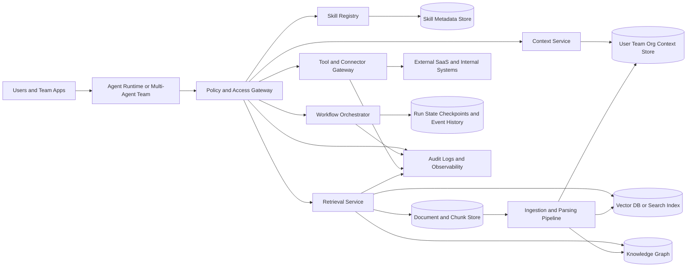

# Architecture

> Part of the synapse design docs. See also
> [`data-model.md`](data-model.md) · [`api.md`](api.md) · [`governance.md`](governance.md) ·
> [`roadmap.md`](roadmap.md) · [`operations.md`](operations.md) ·
> [`research-report.md`](research-report.md) (the full research this distills).

## The concept: an organizational brain

There is no single vendor definition of an "organizational AI brain." Vendors ship *adjacent*
pieces under names like memory, knowledge sources, knowledge graphs, projects, skills, plugins,
tools, connectors, and orchestration runtimes. synapse therefore adopts an **architectural**
definition rather than a brand one:

> An organizational brain is the **governed layer** — sitting *outside* any one agent — that gives
> every agent and team permission-aware access to reusable **skills**, bounded **memory**,
> enterprise **documents**, **retrieval**, and **tool execution**, through a small, stable
> **orchestration and policy** surface, with **audit** on everything that changes behavior or causes
> a side effect.

Strong brains are **composite systems, not monoliths**. They combine a skill/tool registry, a
user/team/org context store, a document + chunk store, a vector-capable retrieval layer with
metadata filtering, an optional graph layer for entity/relationship reasoning, a connector/MCP
gateway, and an orchestration layer that runs both synchronously (fast Q&A) and durably/asynchronously
(long-running work). The robust ones treat **source permissions as first-class data** and **version**
everything that can silently change behavior.

For a multi-team organization — say, a disaster-response drone operator — this matters concretely: an
operator asking "how do we recover a downed drone after signal loss?" needs the *right* runbook, scoped to
their team, filtered by what they're allowed to see, with a citation trail; and an agent that opens a
recovery ticket must pass through policy, approval, and audit before it writes anything.

## Reference architecture (7 MVP components)

Read the diagram as: **users/agents never touch storage directly.** Every request passes the
**Policy & Access Gateway**, which fans out to five services. Retrieval reads the document/chunk
store, the vector index (pgvector), and — optionally, later — a knowledge graph. An **ingestion
pipeline** fans documents out to the vector index, the graph, and the context service. **Everything**
emits to audit + observability (OpenTelemetry).

### The seven components

Each maps to a source module and a set of migrations/tables. Storage details are in
[`data-model.md`](data-model.md); the endpoint contract is in [`api.md`](api.md); the policy model is
in [`governance.md`](governance.md).

1. **Document ingestion pipeline** — pull from a few high-value systems of record, extract text +
   metadata, preserve source IDs, chunk, embed, and stamp every derived artifact with source version
   and ACL inheritance. Fans out to vector + (optional) graph + context.
   Code: `src/api/documents.rs`, `src/retrieval/`. Entry: `POST /documents.ingest`.

2. **Canonical metadata & policy store** — Postgres + JSONB + Row-Level Security as the *source of
   truth* for document manifests, ACLs, principals, teams, skill manifests, run metadata, and
   retention rules. Derived artifacts are rebuildable; canonical records are authoritative.
   Tables: `tenants`, `principals`, `teams`, `team_members`, `documents`, `document_acl`
   (migrations `0002`, `0004`).

3. **Hybrid retrieval** — pgvector dense vectors **plus** lexical/sparse terms **plus** a rerank
   stage, always filtered by ACL before ranking. Hybrid-first because enterprise queries mix exact
   identifiers, policy names, acronyms, and semantic paraphrase in one request.
   Code: `src/retrieval/hybrid.rs`, `src/retrieval/embed.rs`. Table: `chunks` (migration `0005`).
   Entry: `POST /retrieve`.

4. **Context service** — per-principal / team / org context (role, approval limits, preferred tools,
   active projects, data-classification flags). Answers small, explicit questions — *who* is the
   requester, *what* team scope applies, *what* tools are allowed, *what* approvals are needed — and
   is kept **separate from chat history** so personal memory can be minimized and governed.
   Code: `src/context_service.rs`, `src/api/context.rs`. Table: `context` (migration `0003`).
   Entry: `POST /context.upsert`.

5. **Skill registry** — versioned, discoverable skills with input/output JSON Schemas, required
   tools, triggers, and policy tags. Skills are immutable by version and referenceable without
   prompt copy-paste. Code: `src/skills/registry.rs`, `src/api/skills.rs`. Table: `skills`
   (migration `0006`). Entry: `POST /skills.register`.

6. **Tool / connector gateway** — one policy-guarded, MCP-style choke point for every external
   action: auth, tool metadata, allowed operations, approval requirements, rate limits, and audit.
   Code: `src/tools/gateway.rs`, `src/tools/registry.rs`, `src/mcp.rs`, `src/api/tools.rs`.
   Tables: `tool_definitions`, `tool_executions` (migrations `0007`, `0029`, `0030`). Entries:
   `POST /tool.execute`, `/tools.register`, `/tools.list`, `/tools.decide`, `/tools.rollback`.

7. **Durable orchestration + observability** — start/resume long-running runs, human-in-the-loop
   callbacks, and end-to-end audit + tracing. Turns "a pile of memory and tools" into an operational
   brain. Code: `src/orchestration/runs.rs`, `src/api/runs.rs`, `src/audit.rs`, `src/telemetry.rs`.
   Tables: `runs`, `run_events`, `run_checkpoints`, `audit_events` (migrations `0007`, `0008`).
   Entries: `POST /runs.start`, `POST /runs.resume`, `GET /audit/events`.

## Two axes of access: sync vs async, event vs request

A brain must serve two very different work shapes, and the choice should follow **work shape, not
engineering fashion**.

### Synchronous request/response vs durable asynchronous

| Use **synchronous** request/response | Use **durable asynchronous** execution |
| --- | --- |
| Retrieval, ranking, classification, short tool calls | Jobs that trigger human review or external workflow completion |
| Must resolve inside one user interaction | Work spans hours or days, or depends on slow connectors |
| `POST /retrieve`, read-only `POST /tool.execute` | `POST /runs.start` → suspend → `POST /runs.resume` |
| No state to recover if the client disconnects | State must survive restarts, retries, and approvals |

synapse serves both from the same service. Fast paths return typed responses immediately; durable
paths persist a run state machine (`runs`), an append-only event history (`run_events`), and
pause/resume checkpoints (`run_checkpoints`) so a run can wait on a human approval or a webhook
without holding a connection open. Polling and fragile client-side waits do not scale operationally,
which is exactly why durable orchestration exists.

### Event-driven vs request-driven

- **Request-driven** fits deterministic lookup and tool invocation — the interactive agent loop.
- **Event-driven** fits long-running, cross-agent, or cross-system behavior — triggers, retries,
  webhooks, sync-completion callbacks, and post-action follow-up.

Most organizations want **both**: request-driven APIs for interactive work and an event surface for
callbacks. In synapse the durable run's `callbacks: { human_approval, webhook }` and the
`run_events` history are the seam where event-driven integration attaches. The MVP wires the
request-driven side end-to-end and leaves an explicit `TODO` for an external event bus.

## Architectural patterns (and why the default is federated)

The research identifies four recurring patterns:

1. **Retrieval-centric** — ingest, chunk, embed, index; agents query at runtime. Simple, fast to
   ship; weak on workflow state and multi-hop reasoning if left alone. This is synapse's *starting*
   posture.
2. **Workflow-centric** — orchestration is the organizing principle (plans, approvals, retries,
   callbacks, handoffs). Better for multi-hour/day work and human sign-off; costs operational
   complexity and event-schema discipline.
3. **Graph-enhanced** — an entity/relationship layer over documents and vectors. Strong for
   "who owns this," "what depends on this," "which policy applies," multi-hop queries; costs modeling
   and governance overhead, and becomes shelfware without a maintained ontology.
4. **Team-scoped / federated** — a small shared substrate (identity, policy, audit, connector
   contracts) plus many team/workspace partitions for content and memory.

### Recommendation: a federated, permission-aware brain

For most medium and large organizations — and any multi-team structure — the right default is
the **federated, permission-aware brain**. Canonical metadata and policy live in a transactional
store; semantic retrieval lives in a vector/search layer; relationships can live in a graph *when
multi-hop reasoning matters*; and agents reach all of it through a **small number of
policy-enforced APIs**.

This scales better than embedding all memory and knowledge inside each agent runtime, and it creates
cleaner boundaries for multi-team governance, auditability, and migration. Pinecone namespaces,
Weaviate multi-tenant shards, Postgres row-level security, Glean permission mirroring, and Atlassian
connector permission sync all point the same way: **team and tenant boundaries must be expressed in
the storage model and the query model — not in UI logic.** synapse operationalizes this with a
plain-text `tenant_id` on every tenant-scoped table plus fail-closed RLS keyed on an
`app.tenant_id` GUC (see [`governance.md`](governance.md)).

The **API surface stays small and boring**: retrieval, context, skills, tool execution, runs, audit.
Schemas are explicit and stable; there are no hidden prompt-dependent contracts. See
[`api.md`](api.md) for the full contract and [`roadmap.md`](roadmap.md) for the staged path from
retrieval to governed autonomous writes.

## Design principles (threaded through the code)

- Keep the brain **outside** any one agent — agents are clients, the brain is shared infrastructure.
- Separate **canonical source-of-truth** from **derived retrieval artifacts** (rebuildable).
- Make **ACLs queryable** — namespace/shard/row-level, not UI-only.
- Support both **sync request/response** and **durable async** with resumable runs.
- **Hybrid retrieval first, graph later.**
- **Version** skills, prompts, chunking, embedding model, and eval sets.
- Separate **personal memory** from org knowledge and **minimize PII**.
- Require **audit + approval before autonomous writes**.
