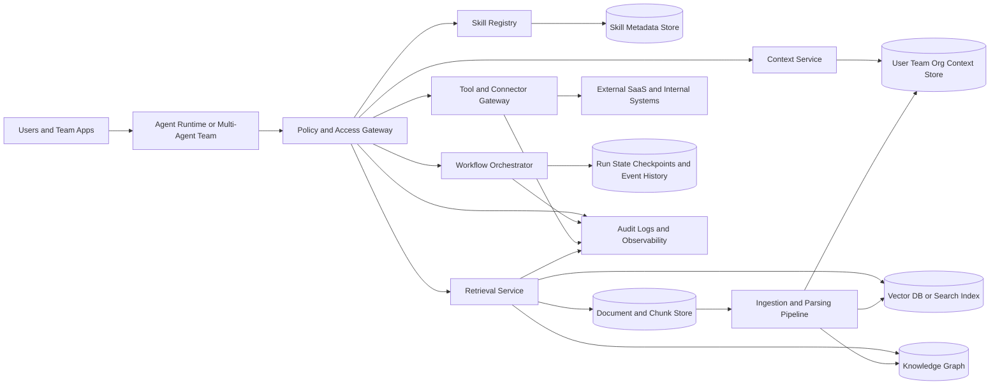

# Organizational Brains for AI Agents and Team Workflows

## Executive summary

There is no single, standardized industry definition of an organizational AI “brain” in primary vendor documentation. Instead, vendors describe adjacent components under terms such as **memory**, **knowledge sources**, **knowledge graphs**, **projects**, **skills**, **plugins**, **tools**, **connectors**, and **orchestration runtimes**. A rigorous working definition is therefore architectural rather than brand-specific: an organizational brain is the governed layer that gives agents and teams access to reusable skills, bounded memory, enterprise documents, permission-aware retrieval, and tool execution through a stable orchestration and policy surface. MCP formalizes some of this surface as resources, prompts, and tools over JSON-RPC and JSON Schema; LangGraph distinguishes short-term and long-term memory; Claude exposes skills and project knowledge bases; Copilot Studio exposes knowledge sources, tools, and generative orchestration; Glean, Atlassian, and ServiceNow center the idea around permission-aware context graphs. citeturn3search8turn3search12turn0search13turn30search6turn25search5turn12search4turn14search6turn12search3turn29search6

In practice, strong organizational brains are **composite systems**, not monoliths. They usually include: a skill or tool registry; a user, team, and org context store; a document and chunk store; a vector-capable retrieval layer with metadata filtering; sometimes a graph layer for entity and relationship reasoning; a connector or MCP gateway for external systems; and an orchestration layer that can execute synchronously for fast question answering and durably/asynchronously for long-running work. The most robust systems treat source permissions as first-class data, not as an afterthought, and they version both knowledge objects and behavioral assets such as prompts, skills, and retrieval settings. citeturn30search9turn14search6turn1search8turn2search4turn6search4turn31search0turn31search3

The strongest architectural pattern for most organizations is a **federated, permission-aware brain**: canonical metadata and policy live in a transactional store; semantic retrieval lives in a vector or search engine; relationships and ownership can live in a graph when multi-hop reasoning matters; and agents access all of it through a small number of policy-enforced APIs. This design scales better across teams than embedding all memory and knowledge inside each agent runtime, and it creates cleaner boundaries for multi-team governance, auditability, and migration. Pinecone namespaces, Weaviate multi-tenancy, PostgreSQL row-level security, Glean permission mirroring, and Atlassian connector permission sync all point in the same direction: **team and tenant boundaries must be expressed in the storage model and the query model**. citeturn1search8turn1search16turn2search4turn20search1turn19search0turn14search6turn29search0

For most organizations, “brain” maturity should advance in stages. The lowest-risk path is to begin with permission-aware document retrieval and a small skill registry, then add user/team context, then durable workflow orchestration, and only later introduce graph augmentation or write-capable agent actions. Durable workflow systems such as LangGraph, Temporal, Google Workflows, and AWS Step Functions are especially valuable once agents must pause for human approval, wait on external callbacks, or recover from failures without losing state. citeturn4search11turn31search0turn31search1turn31search2

A minimal viable “brain” for a pilot does **not** require a giant platform purchase. A pragmatic blueprint is: PostgreSQL with JSONB and row-level security for canonical metadata and ACLs; pgvector or a managed vector layer for embeddings; object storage for raw documents; a small skill registry using JSON Schema-like contracts; an MCP or REST tool gateway; a durable orchestrator; and OpenTelemetry-based tracing plus an evaluation layer such as LangSmith or a similar stack. Current published list prices suggest that embedding ingestion with a small embedding model can be extremely cheap relative to the monthly minimums of managed vector databases and per-seat observability tools; for many pilots, governance, orchestration, and ongoing model inference are the larger design concerns than embeddings themselves. citeturn18search3turn19search0turn18search0turn10search0turn10search5turn11search0turn11search1turn11search10

The most actionable design recommendations are straightforward. Keep the brain **outside** any one agent implementation. Separate **source-of-truth content** from **retrieval artifacts**. Make ACLs queryable. Support both **request-driven** and **event-driven** access patterns. Version everything that can silently change behavior. Collect traces, logs, metrics, and evaluation results together. And add write actions only after you have audit trails, approval points, and rollback paths. These are not optional “enterprise extras”; they are the difference between a demo brain and an organizational one. citeturn21search16turn21search3turn23search1turn23search7turn26search3

## Definitions and taxonomy

The term **organizational brain** is best treated as a synthesis layer over several officially documented concepts rather than as a vendor-defined product category. MCP defines a standard way for AI applications to access **resources**, **prompts**, and **tools**. LangGraph separates short-term state from long-term stores. Claude defines **skills** as folders of instructions, scripts, and resources loaded dynamically, and **projects** as workspaces with their own histories and knowledge bases. CrewAI names five agent-extension types—tools, MCPs, apps, skills, and knowledge. Copilot Studio uses tools, topics, agents, and knowledge sources under a generative orchestration model. Taken together, these sources support an architectural taxonomy in which a brain is the layer that holds reusable capabilities, organization-specific context, governed knowledge, and controlled actuation pathways. citeturn3search8turn0search13turn30search6turn25search5turn30search9turn12search4

A useful taxonomy has eight parts.

**Skills** are reusable behavioral units. In the most explicit current definition, Claude skills are packages of instructions, scripts, and resources that load dynamically when relevant. CrewAI similarly exposes skills as a first-class capability extension, while Semantic Kernel uses plugins and functions as the closest structural equivalent. For architecture work, it is reasonable to define a skill as a versioned, invocable unit that combines task instructions, input/output schemas, examples, and optional tool dependencies. citeturn30search6turn30search9turn33search0

**Context stores** hold relatively durable user, team, and organizational state that should influence behavior but is not itself a document corpus. Examples include role, department, group memberships, preferred tools, working hours, current project, approval authority, and environment-specific policies. Some vendors present this as team or project context, while others fold it into graphs or profile signals. Atlassian’s Teamwork Graph and Glean’s knowledge-graph approach both demonstrate that this layer often includes relationships among people, teams, projects, and documents, not just user preferences. citeturn12search3turn12search23turn13search9turn13search13

**Memory** needs stricter distinctions than many demos make. LangGraph explicitly separates short-term memory in thread or run state from long-term memory stored across sessions in JSON documents and namespaces. Semantic Kernel distinguishes short-term “whiteboard” memory from longer-term memory providers and allows both in the same agent. A practical organizational taxonomy is: working memory for in-run state; episodic memory for past interactions or run artifacts; semantic memory for durable facts/preferences; and procedural memory for reusable task patterns, which in many products maps to skills, plugins, or saved flows. citeturn0search13turn4search11turn33search2turn33search14

**Document stores** are the canonical home for source content and manifests. Azure AI Search’s model is instructive here: indexes contain search documents, while indexing pipelines pull or receive JSON documents and may chunk and enrich them before search. In a brain architecture, raw files and source-system objects remain the immutable record; chunks, vectors, sparse terms, and graph edges are derivative artifacts that can be rebuilt. That distinction matters for governance, re-indexing, and auditability. citeturn28search4turn28search13turn6search11

**Vector databases and vector-capable search layers** store or index embeddings for semantic retrieval. Weaviate, Pinecone, pgvector, and Azure AI Search each support vectors with varying degrees of metadata filtering, multitenancy, hybrid search, or integrated pipelines. The key architectural point is not the brand but the function: efficient nearest-neighbor retrieval over chunk or entity embeddings, ideally with strong metadata and ACL constraints. citeturn2search18turn1search4turn18search0turn28search7

**Knowledge graphs** organize entities and relationships. Neo4j defines a knowledge graph as a pattern for storing and accessing interrelated data entities and their semantic relationships. ServiceNow’s Knowledge Graph and Atlassian’s Teamwork Graph show how vendors increasingly use graph-like context models to improve agent grounding and reasoning, especially when ownership, dependency, workflow, or multi-hop relationship traversal matters. A graph does not replace vector retrieval; in enterprise systems it typically complements it. citeturn6search4turn29search6turn12search3turn13search13

**Tool connectors** expose external systems for read or write actions. MCP is the clearest open standard here, exposing tools and resources through a host-client-server architecture over JSON-RPC. Glean, Copilot Studio, Atlassian Rovo, and Claude all emphasize connectors or MCP-mediated access as the way agents leave the chat box and reach systems of record. The design implication is that tool access belongs behind explicit contracts, auth, and policy—not inside ad hoc prompt instructions. citeturn3search8turn3search3turn14search6turn12search12turn29search16turn25search4

**Orchestration layers** decide how work is sequenced, paused, retried, approved, and resumed. LangGraph offers durable execution, streaming, interrupts, and persistence. Semantic Kernel’s Process Framework is event-driven and stateful. AutoGen’s core is explicitly event-driven and actor-like. Copilot Studio’s generative orchestration selects among agents, tools, and knowledge sources and can respond to events. Durable orchestration is what turns a collection of memories and tools into an operational brain. citeturn4search4turn5search7turn33search13turn5search4turn12search4

## Architecture patterns and integration patterns

A reference architecture for an organizational brain should assume four truths. Agents need access to both **knowledge** and **action**. Teams need stronger boundaries than individual chats. Long-running work needs durable state. And permissions must survive ingestion, retrieval, ranking, and tool execution, not just login. Platforms as different as Glean, Rovo, Pinecone, Weaviate, LangGraph, and Copilot Studio converge on these requirements even when the product vocabulary differs. citeturn14search6turn29search0turn1search8turn2search4turn31search3turn12search4



The most common architectural pattern is a **retrieval-centric brain**. Documents are ingested, chunked, embedded, and indexed; agents query the retrieval layer at runtime and compose an answer or downstream action from the results. This is the basic shape behind many enterprise-search and RAG products and is often enough for FAQ, support, policy, and knowledge-assistant use cases. Azure AI Search’s indexing model, Weaviate’s vector and hybrid search, Pinecone’s metadata filtering and reranking, and Glean’s connector-based indexing all fit this pattern. Its strengths are simplicity and fast delivery; its weakness is that it can struggle with workflow state, multi-hop relationships, or durable action coordination if left alone. citeturn28search13turn6search0turn27search2turn1search16turn27search13turn14search6

A second pattern is a **workflow-centric brain**, where orchestration is the primary organizing principle. Here, the brain is not only a retrieval layer but also the stateful runtime for plans, approvals, retries, callbacks, and handoffs. LangGraph’s checkpointing and interrupts, Temporal’s event history, Google Workflows callbacks, and AWS Step Functions `.sync` or callback patterns exemplify this approach. This pattern is better than plain RAG when work spans hours or days, depends on external systems, or requires human sign-off. Its trade-off is operational complexity and the need for stronger event schemas and idempotency discipline. citeturn4search11turn31search0turn31search12turn31search1turn31search2

A third pattern is a **graph-enhanced brain**. This adds an entity and relationship layer on top of documents and vectors. Neo4j and ServiceNow explicitly position knowledge graphs as a way to improve grounded reasoning and multi-hop retrieval. In organizational settings, graphs are particularly valuable for “who owns this,” “what depends on this,” “which team and policy apply,” and “how do these artifacts connect” queries. The weakness is cost and modeling overhead; if the organization cannot maintain a useful ontology or ownership graph, a graph layer becomes shelfware. citeturn6search4turn1search18turn29search6

A fourth pattern is a **team-scoped or federated brain**. Instead of one global store, the organization keeps a small shared substrate—identity, policy, audit, connector contracts—and many team or workspace partitions for content and memory. Pinecone recommends namespaces for tenant isolation; Weaviate uses tenant-specific shards in multi-tenant collections; PostgreSQL row security and JSONB provide a transactional basis for team-bound canonical data; Claude and Copilot expose projects or environments as bounded workspaces. This pattern is the best default for most medium and large organizations because it preserves local autonomy without sacrificing shared governance. citeturn1search8turn2search4turn19search0turn25search5turn20search2

The **API surface** of a strong brain should be small and boring. A practical design is to provide: a retrieval API; a context API; a skill registry API; a tool execution API; and a run/orchestration API. MCP is especially useful for tool and resource exposure because it standardizes the host-client-server contract and uses JSON Schema for validation. For internal services, ordinary REST or gRPC is still fine; the main architectural discipline is to make schemas explicit and stable and avoid hidden prompt-dependent contracts. citeturn3search8turn3search12

The **sync versus async** choice should follow work shape, not engineering fashion. Use synchronous request-driven access for retrieval, ranking, classification, or short tool calls that must resolve in one user interaction. LangGraph’s `stream` and `astream`, MCP’s request/response tools, and typical search APIs fit here. Use asynchronous, durable execution when jobs trigger human review, external workflow completion, or slow connectors. Temporal, Step Functions, and Google Workflows all document durable waiting patterns precisely because polling and fragile client-side waits do not scale operationally. citeturn5search3turn3search3turn31search0turn31search1turn31search2

The **event-driven versus request-driven** distinction matters for integration style. AutoGen Core explicitly supports asynchronous messages, request/response, and pub-sub topics. CrewAI Flows is event-driven, and CrewAI event listeners expose internal execution events. Event-driven patterns fit long-running, cross-agent, or cross-system behaviors; request-driven patterns fit deterministic lookup and tool invocation. Most organizations want both: request-driven APIs for interactive agent work and event buses for triggers, retries, webhooks, sync completion, and post-action follow-up. citeturn5search4turn5search0turn32search0turn32search10

Two illustrative official diagrams worth reviewing alongside the reference architecture are the [Microsoft Copilot Studio generative orchestration guidance](https://learn.microsoft.com/en-us/microsoft-copilot-studio/guidance/generative-orchestration), which explains how tools, topics, agents, and knowledge sources are composed, and the [Neo4j knowledge-graph generation article](https://neo4j.com/blog/developer/knowledge-graph-generation/), which includes a concrete GraphRAG-oriented schema illustration. Both are useful visual complements to the taxonomy above. citeturn12search20turn6search10

## Data models, storage, and retrieval

A brain’s internal data model should distinguish **canonical records** from **derived retrieval artifacts**. Canonical records are source metadata, access rules, team structure, skill definitions, connector registrations, and run history. Derived artifacts are text chunks, embeddings, sparse terms, similarity scores, graph triples, and rerank results. This separation makes re-indexing possible and keeps governance anchored to stable business objects instead of transient retrieval outputs. Azure AI Search’s split between search documents and indexing pipelines, LangGraph’s JSON-based long-term memory documents, and PostgreSQL’s JSONB document support all align with this principle. citeturn28search4turn28search13turn0search13turn18search3

A practical **skill schema** should be explicit about invocation, scope, and policy. No single vendor schema is universal, but MCP’s JSON Schema usage and Semantic Kernel’s plugin/function model make a good foundation. The example below is proposed, not standardized.

```json
{
  "skill_id": "skill.approval.draft_response",
  "version": "1.2.0",
  "name": "Draft Approval Response",
  "summary": "Draft a response for approval workflows",
  "owners": ["team-ops"],
  "triggers": ["approval request", "legal review"],
  "input_schema": {
    "type": "object",
    "properties": {
      "request_id": { "type": "string" },
      "context": { "type": "string" }
    },
    "required": ["request_id"]
  },
  "output_schema": {
    "type": "object",
    "properties": {
      "draft": { "type": "string" },
      "citations": { "type": "array", "items": { "type": "string" } }
    },
    "required": ["draft"]
  },
  "required_tools": ["tool.search_docs", "tool.create_draft"],
  "policy_tags": ["read:team_docs", "write:drafts", "human_approval_required"],
  "examples": [
    {
      "input": { "request_id": "REQ-123" },
      "output": { "draft": "..." }
    }
  ]
}
```

A **user and team context schema** should carry only the minimum durable information needed for personalization, routing, and policy. That usually means identity and role data, group memberships, preferred working context, and current workspace or project—not raw conversation logs or unnecessary PII. NIST and the ICO both emphasize minimization and purpose limitation for personal data, which matters directly for memory design. The following is a recommended pattern.

```json
{
  "principal_id": "user_9281",
  "tenant_id": "acme",
  "team_ids": ["finance", "procurement"],
  "role": "manager",
  "location": "US",
  "approval_limit_usd": 25000,
  "preferred_tools": ["slack", "google_drive", "erp"],
  "active_projects": ["vendor-onboarding-q3"],
  "policy_overrides": ["requires_human_approval_for_wire_changes"],
  "data_classification": {
    "contains_pii": false,
    "special_category": false
  },
  "updated_at": "2026-07-01T00:00:00Z"
}
```

A **document schema** should keep source identity and access control adjacent to content metadata. Azure AI Search stores vectors at the field level alongside nonvector content, which is a useful mental model even if the final implementation uses different stores. Recommended fields are shown below.

```json
{
  "doc_id": "doc_8742",
  "tenant_id": "acme",
  "team_scope": ["finance"],
  "source_system": "google_drive",
  "source_uri": "gdrive://file/abc",
  "title": "Quarterly close checklist",
  "content_type": "application/pdf",
  "language": "en",
  "version": "sha256:...",
  "created_at": "2026-06-20T14:00:00Z",
  "updated_at": "2026-06-28T09:12:00Z",
  "owners": ["user_9281"],
  "acl": {
    "users": ["user_9281"],
    "groups": ["finance-managers"],
    "inherit_from_source": true
  },
  "metadata": {
    "fiscal_quarter": "Q2",
    "department": "Finance"
  }
}
```

A **chunk and embedding schema** should preserve parent-child relationships and chunk provenance. This is where many systems become hard to debug; they store vectors without enough metadata to explain why a result appeared.

```json
{
  "chunk_id": "chunk_8742_07",
  "doc_id": "doc_8742",
  "tenant_id": "acme",
  "ordinal": 7,
  "section_path": ["Close Process", "Reconciliation"],
  "text": "Reconcile outstanding journal entries before lock.",
  "token_count": 31,
  "char_start": 6112,
  "char_end": 6180,
  "embedding_model": "text-embedding-3-small",
  "embedding_dimensions": 1536,
  "vector_ref": "vec://brain/chunk_8742_07",
  "sparse_terms_ref": "bm25://brain/chunk_8742_07",
  "metadata": {
    "document_version": "sha256:...",
    "contains_pii": false
  }
}
```

For **storage choices**, a durable transactional store remains essential even in an “AI-native” stack. PostgreSQL with JSONB works well for canonical metadata, ACLs, skill manifests, run metadata, and audit-adjacent state; pgvector adds approximate nearest-neighbor indexing via HNSW or IVFFlat, with documented trade-offs between build cost, memory, and recall. Dedicated vector stores become more attractive when multitenancy, scale, or managed operational features outweigh the simplicity of keeping everything in Postgres. citeturn18search3turn18search0turn18search8

For **retrieval**, hybrid search is now the default best starting point rather than an enhancement. Weaviate explicitly combines vector and BM25 search; Elastic recommends hybrid search with reciprocal rank fusion; Pinecone emphasizes metadata filters and a second-stage reranker to improve result quality. In organizational brains, hybrid search matters because enterprise queries usually combine exact identifiers, policy names, acronyms, and semantic paraphrases in the same request. citeturn27search2turn27search6turn27search3turn27search7turn27search13

For **chunking**, there is no universally correct chunk size, and current primary documentation supports structural and semantic chunking over one-size-fits-all heuristics. Azure AI Search’s Document Layout guidance recommends chunking based on headings, paragraphs, and semantic coherence, not arbitrary fixed windows alone. A good organizational default is: preserve document structure; keep parent-child references; store neighboring chunk IDs for adjacency expansion; and reserve very large chunks for agentic retrieval cases where full sections matter more than pure recall. If that level of detail is not yet implemented, it should be marked as unspecified rather than assumed. citeturn6search0turn6search1turn6search3

For **graph augmentation**, use it selectively. If the main problem is keyword and semantic retrieval over documents, hybrid search is usually enough. If the main problem is cross-document reasoning over ownership, workflows, entities, or policy dependencies, a graph layer can materially improve retrieval and explainability. Neo4j’s GraphRAG material explicitly combines vector indexes, keyword search, and graph traversal, which is a good design cue: graphs are strongest when they participate in retrieval, not when they are used as a detached “AI add-on.” citeturn1search18turn1search10turn6search12

## Governance, access control, and compliance

Governance for an organizational brain begins with one simple rule: **the source system remains the source of truth for access unless you have an explicit reason to override it**. Glean’s connectors are built around indexing content and mirroring permissions into an isolated tenant. Atlassian documents that Rovo keeps third-party connector permissions in sync. Glean’s code search documentation is explicit that source-of-truth ACLs are mirrored down to repository and document level. This is the correct default for document and search access because it reduces policy drift between systems. citeturn14search6turn29search0turn14search2

The second governance rule is that **tenant and team boundaries must exist in storage and query plans, not only in UI logic**. Pinecone recommends namespaces for tenant isolation and notes performance and cost benefits relative to simple tenant metadata filters. Weaviate’s multi-tenancy model uses tenant shards, and PostgreSQL supports row security policies that can restrict rows by role and command. These are materially different mechanisms, but they all operationalize the same design decision: isolation must be enforced where the query executes. citeturn1search8turn1search0turn2search4turn19search0turn19search2

The third rule is **RBAC plus source-aware exceptions**. Weaviate recommends RBAC for production authorization. Pinecone uses organization and project roles plus service accounts. Copilot Studio is governed through environment and Dataverse security roles. Claude Team and Enterprise now support custom roles and group-scoped skill and connector access. In other words, durable brains need at least two layers of access logic: platform roles controlling administrative surfaces and source-derived permissions controlling knowledge/tool access. citeturn20search4turn20search9turn20search17turn20search2turn30search12turn30search20

The fourth rule is **audit everything that changes behavior or causes side effects**. Glean exposes admin audit logs and workflow logs; Microsoft documents auditing for agent interactions through Purview and telemetry through Application Insights; Google Workflows emits audit logs; OpenAI’s public API reference includes administration audit-log endpoints. A real organizational brain therefore needs observable records for: connector configuration changes, skill version changes, permissions changes, tool executions, run state transitions, and human approvals. If the selected platform does not provide built-in audit facilities for a given dimension, that gap should be called out explicitly. citeturn23search1turn23search17turn23search2turn26search7turn31search17turn23search0

The fifth rule is **PII minimization and purpose limitation**. NIST’s PII guidance recommends minimizing PII collection and tailoring safeguards to impact level, while the ICO’s data minimization principle requires personal data to be adequate, relevant, and limited to what is necessary. For brain design, that means: do not dump entire HR, CRM, or support datasets into long-term memory by default; tag sensitive content early; separate interaction transcripts from reusable semantic facts; and define retention schedules independently for documents, runs, traces, and memories. citeturn22search0turn22search4turn22search2turn22search10

Versioning needs to cover more than code. Skills, tool schemas, prompts, chunking strategies, embedding model versions, source document versions, graph extraction runs, and evaluation datasets all change behavior. LangSmith explicitly versions datasets for evaluation; LangGraph persistence and CrewAI checkpointing support state resumption and forking; Claude skills are provisioned centrally with package files; multi-version search indexes are possible in Azure AI Search and graph/vector stacks. The safest enterprise pattern is to stamp every derived artifact with the source version, chunking profile version, and embedding model version so a rebuild can be explained later. citeturn21search11turn31search7turn32search19turn30search8turn28search1

Human approval should be designed as a first-class policy primitive, not a UX fallback. LangGraph interrupts are durable; CrewAI and Copilot Studio support human-in-the-loop patterns; Glean documents conditions under which inline execution of write tools is allowed and notes that permissions, auth, and audit logs still apply. The right operational stance is: read actions may often be autonomous, but sensitive write actions should carry approval classes and escalation paths. citeturn5search7turn5search2turn5search6turn23search7

## Tooling, frameworks, and platform catalog

The current market splits into three broad groups. First are **orchestration frameworks** such as LangGraph, Semantic Kernel, AutoGen, and CrewAI. Second are **storage and retrieval substrates** such as Pinecone, Weaviate, Neo4j, pgvector, Azure AI Search, and Elasticsearch. Third are **commercial work-AI suites** such as Glean, Copilot Studio, Rovo, ServiceNow, Salesforce, Guru, and Claude Team/Enterprise, which package retrieval, connectors, policies, and collaboration features into one operating model. The right choice depends less on model preference than on where the organization wants to own complexity: in the application layer, in the data layer, or in a suite. citeturn4search4turn33search6turn4search6turn32search16turn11search0turn2search18turn6search4turn18search0turn14search1turn26search9turn12search3turn12search10turn12search17turn13search14turn25search2

Another useful official visual is the [Atlassian Teamwork Graph and Rovo Studio overview](https://www.atlassian.com/software/rovo/studio), which illustrates how graph context, permissions, and agent workflows are being packaged for teams rather than individual agents. It is especially relevant if your goal is to support team workflows rather than only single-agent Q&A. citeturn12search23

| Name | Type open/commercial | Core components | Storage choices | Integration methods | Strengths | Weaknesses | Typical use cases | Primary sources |
|---|---|---|---|---|---|---|---|---|
| LangGraph + LangSmith | Open-source core + commercial observability | Graph runtime, nodes/edges, checkpointers, long-term stores, traces/evals | Checkpointers, memory stores, optional Postgres-backed persistence | LangChain integrations, sync/async streaming, HITL interrupts | Strong durable execution and debugging; good for custom agent runtimes | More assembly required than suite products | Custom multi-step agents, approvals, long-running tasks | LangGraph + LangSmith docs citeturn4search4turn4search11turn5search3turn21search3turn11search11 |
| Semantic Kernel | Open-source | Kernel, plugins/functions, vector-store connectors, process framework, agent framework | In-memory or external vector stores; file/memory process persistence | Plugins, function calling, process framework, SDKs for C#/Python/Java | Strong enterprise middleware model; clear plugin abstraction | More framework than finished product | Enterprise agents embedded into existing apps | Official docs citeturn33search6turn33search0turn33search1turn33search5turn0search1 |
| AutoGen | Open-source | Agents, teams, core runtime, topics/subscriptions, distributed runtime, OTel | Agent state in runtime; distributed runtime patterns documented | Async messaging, pub-sub, agent-as-tool, OTel | Strong event-driven multi-agent patterns | Requires engineering maturity for production ops | Event-driven multi-agent systems, research and complex coordination | Official docs citeturn4search6turn5search4turn5search0turn21search9turn21search17 |
| CrewAI | Open-source + commercial AMP | Crews, flows, memory, knowledge, tools, skills, observability hooks | Unified memory system; knowledge sources; checkpoints | Event-driven flows, tools, MCPs, apps, skills, listeners | Fast path to multi-agent workflows with built-in concepts | Product surface is broad; architecture can become opinionated | Team workflows, orchestrated crews, rapid prototypes to production | Official docs citeturn32search16turn30search9turn32search10turn32search0turn32search19 |
| Pinecone | Commercial | Managed vector DB, namespaces, metadata filters, reranking, inference models | Dense/sparse/full-text indexes, namespaces | API/SDKs, metadata filters, rerank endpoint | Simple managed semantic retrieval with strong tenant patterns | Less suited for rich transactional metadata than Postgres | Semantic search, RAG, multi-tenant retrieval | Official docs citeturn1search8turn1search16turn27search13turn27search17turn11search0 |
| Weaviate | Open-source + commercial cloud | Vector DB, hybrid search, filtering, multi-tenancy, RBAC | Vector indexes + inverted indexes; tenant shards | API/SDKs, hybrid search, scalar filters, RBAC | Good hybrid search and multitenancy story | Cross-reference-heavy models can add complexity | AI-native search, hybrid retrieval, SaaS tenant isolation | Official docs citeturn2search18turn27search2turn2search4turn20search1turn2search6 |
| Neo4j GraphRAG | Commercial + open tooling | Property graph, vector indexes, full-text indexes, GraphRAG tooling | Graph DB with vector and full-text indexes | Python package, Cypher, graph/vector retrieval | Excellent for entity, ownership, and multi-hop reasoning | Higher modeling and governance overhead | Graph-enhanced RAG, dependency and relationship reasoning | Official docs citeturn6search4turn1search2turn1search10turn6search12 |
| pgvector + PostgreSQL | Open-source | Transactional DB, JSONB metadata, row security, HNSW/IVFFlat vectors | Postgres tables, JSONB, vector columns | SQL, app APIs, RLS | Strong canonical metadata + ACL foundation; operational simplicity | Specialized vector features may lag dedicated platforms | Cost-sensitive pilots, unified app + metadata + vector layer | Official docs citeturn18search0turn18search3turn19search0turn19search2 |
| Microsoft Copilot Studio | Commercial | Agents, agent flows, knowledge sources, tools, generative orchestration, analytics | Dataverse environment plus connected knowledge sources; exact low-level storage often abstracted | Prebuilt/custom connectors, tools, events, tests, analytics | Strong governance and low-code team adoption inside Microsoft ecosystems | Some internals are abstracted; suite dependence can be high | Internal copilots, business process agents, M365-centric workflows | Official docs citeturn26search9turn12search4turn12search8turn26search14turn26search5 |
| Glean | Commercial | Work AI platform, connectors, knowledge graph, search, agents, audit and workflow logs | Isolated tenant with indexed content, permissions, activity metrics | 275+ native and MCP-based connectors, custom connectors, tools | Very strong permission-aware enterprise context layer | Public low-level storage internals beyond docs are limited; pricing is sales-led | Enterprise search, assistant, agent grounding across many apps | Official docs citeturn14search1turn14search6turn14search8turn14search12turn23search1 |
| Atlassian Rovo | Commercial | Search, chat, agents, Teamwork Graph, connectors, Rovo Studio, MCP access | Teamwork Graph plus connected app data | Connectors, Rovo MCP, graph-oriented tools | Strong team-workflow context and permissions sync | Best fit is strongest in Atlassian-centered orgs | Team search, project context, agent workflows over Jira/Confluence and connected tools | Official docs citeturn12search3turn12search23turn29search0turn29search16 |
| ServiceNow AI Agent Orchestrator + Knowledge Graph | Commercial | Agent Orchestrator, AI agents, Knowledge Graph, external-agent integration | ServiceNow platform data + knowledge graph resources | Agent studio, tools, external agents, MCP client support in releases | Strong workflow and service-management grounding | Best fit is strongest where ServiceNow already holds process truth | IT, service, and operations agents with workflow depth | Official docs citeturn12search10turn29search6turn12search14turn29search18 |
| Salesforce Agentforce + Data Cloud | Commercial | Agentforce, Data Cloud, vector database, vector/hybrid search, unstructured ingestion | Data Cloud vector database and search indexes | Search index configs, connectors, Agentforce grounding | Strong CRM and customer-ops grounding; vector and hybrid search built into suite | Best fit depends on Salesforce data gravity; some pricing/details are sales- or help-center-led | Sales, support, customer knowledge, Data Cloud-grounded agents | Official docs citeturn12search9turn29search3turn12search1turn29search11turn29search19 |
| Claude Team and Enterprise | Commercial | Projects, project knowledge bases, skills, plugins, connectors, MCP connector | Project knowledge bases and organization-provisioned skills; exact internal storage abstracted | Skills, plugins, remote MCP servers, organization groups/roles | Clear model for reusable skills and project-scoped knowledge | Governance is improving but still product-specific rather than universal infra | Team knowledge work, role-specific skills, connector-enabled assistants | Official docs citeturn25search5turn30search6turn30search8turn25search4turn30search12 |

## Performance, cost, testing, and observability

The main performance trade-offs in a brain are usually not in the model alone. They are in **retrieval fan-out, chunk quality, reranking depth, graph traversals, connector latency, and orchestration durability settings**. LangGraph explicitly describes durability modes with performance implications, pgvector distinguishes HNSW and IVFFlat trade-offs, Weaviate and Elastic document hybrid search fusion and filters, and Pinecone documents reranking as a second stage. This means performance tuning should start by instrumenting retrieval and orchestration boundaries before trying to “buy a smarter model” for everything. citeturn31search19turn18search0turn27search2turn27search7turn27search13

Cost is similarly multi-part. Public list prices show that embeddings can be relatively inexpensive compared with monthly platform minimums. OpenAI currently lists `text-embedding-3-small` at $0.02 per 1M tokens and `text-embedding-3-large` at $0.13 per 1M tokens, with default dimensions of 1536 and 3072 respectively. Pinecone’s Standard plan has a $50/month minimum; Weaviate Flex has a $45/month minimum; Neon’s Launch plan is usage-based with a typical spend of about $15/month; LangSmith Plus is $39/seat/month. The implication is that for many early pilots, the financially meaningful decisions are managed-versus-self-hosted retrieval, observability seats, and generation traffic—not one-time embedding ingestion. citeturn10search0turn10search8turn10search5turn11search0turn11search1turn11search3turn11search10

A reasonable **pilot cost interpretation** from current public pricing is as follows. A lean stack using Postgres/pgvector and mostly open-source orchestration can plausibly stay in the low hundreds of dollars per month before LLM generation costs, especially if observability is built on OpenTelemetry and open tooling. A more managed pilot that adds a hosted vector database and a commercial tracing/evaluation platform typically moves into the mid hundreds or higher. Large enterprise suites often do not publish simple list prices for the relevant AI tiers, so those costs should be treated as unspecified until procurement provides concrete numbers. The important design lesson is to separate **fixed platform commitments** from **usage-driven model and query costs** in planning. citeturn11search0turn11search1turn11search3turn11search10turn21search16

Testing needs to cover more than answer correctness. Copilot Studio now supports test sets and batch evaluation. LangSmith supports offline and online evaluation with versioned datasets and experiment comparison. CrewAI exposes event listeners and knowledge-retrieval events. AutoGen and OpenTelemetry support tracing across events and tool spans. A complete testing program for a brain should therefore include: retrieval regression tests; permission-isolation tests; skill contract tests; tool side-effect tests; latency and timeout tests; and answer-quality evaluations with curated datasets. If the chosen framework lacks one of these categories, the gap should be made explicit and compensated elsewhere. citeturn26search1turn26search5turn21search3turn21search11turn32search0turn32search22turn21search1

Observability for a brain should follow the standard telemetry triad. OpenTelemetry documents traces, metrics, and logs as the core observability signals. AutoGen has native OTel support; LangSmith provides traces and production evaluations; Copilot Studio can send telemetry to Application Insights; CrewAI emits internal events and prompt traces; Google Workflows and Glean both expose loggable run or audit records. In operational terms, you should be able to answer five questions quickly: What did the agent retrieve? What tools did it call? What permissions were enforced? Where did latency go? Which version of skills, prompts, and indexes was active? citeturn21search16turn21search12turn21search9turn21search3turn26search7turn32search0turn23search17

For **brain health**, the best metrics are usually structural rather than conversational. Track connector freshness lag, index build age, chunking failure rate, ACL parity failures, retrieval hit rate by source, reranker lift, graph extraction failures, tool error rates, human-approval rate, and stale-memory reuse incidents. These are the metrics that tell you whether the brain is healthy, regardless of which agent UI sits on top of it. Their exact thresholds are organization-specific and therefore unspecified here; what matters is that the metrics exist and are reviewable. citeturn14search15turn23search17turn21search0

## Recommendations, minimal viable blueprint, and migration path

A sound design strategy is to treat the brain as **shared infrastructure with strong contracts**, not as agent-specific prompt engineering. The recommendations below are stack-agnostic unless a product is explicitly named.

- Keep canonical business data, ACLs, and versions in a transactional store; keep vectors and search artifacts derivable.
- Make permissions queryable and testable. Prefer namespace, shard, or row-level isolation over UI-only filtering.
- Expose retrieval, context, skills, and tool execution through explicit APIs with schema validation.
- Support both fast synchronous request/response paths and durable asynchronous workflow paths.
- Use hybrid retrieval first; add graph augmentation only where relationship reasoning materially improves outcomes.
- Version skills, prompts, chunking profiles, embedding models, and evaluation datasets.
- Separate personal memory from organizational knowledge, and apply minimization rules aggressively.
- Require audit trails and approval points before enabling autonomous write actions. citeturn19search0turn1search8turn3search12turn31search0turn27search2turn6search12turn22search2turn23search7

A **minimal viable brain** for a typical organization can be built from seven components.

First, a **document ingestion pipeline** that can pull from a few high-value systems of record, extract text and metadata, preserve source IDs, and stamp every artifact with source version and ACL inheritance. Azure AI Search’s indexing and chunking guidance is a good model for the shape of this pipeline even if you do not use Azure as the final runtime. citeturn28search13turn6search0turn6search1

Second, a **canonical metadata and policy store**, typically PostgreSQL, holding document manifests, skill manifests, user/team context, run metadata, ACL snapshots, and retention rules. Use JSONB for flexible metadata and row security where query-time isolation is needed. citeturn18search3turn19search0turn19search2

Third, a **retrieval layer** that supports semantic and lexical retrieval together. For the MVP, pgvector or a managed vector store combined with metadata filters is enough. If operational simplicity is critical, use a managed platform; if cost sensitivity and metadata unification are more important, keep it in Postgres first and revisit later. citeturn18search0turn1search16turn27search2turn27search3

Fourth, a **context service** for user, team, project, and policy context. Do not overload chat history for this purpose. The service should answer small, explicit questions: who is the requester, what team scope applies, what tools are allowed, what approvals are needed, and which workspace/project is active. This is the minimum needed to support team workflows cleanly. citeturn12search23turn13search13

Fifth, a **skill registry** with simple contracts. Skills should be immutable by version, have machine-readable input/output schemas, record required tools and policy tags, and be referenceable by agents and workflow nodes without prompt copy-paste. MCP and JSON Schema are strong foundations for this. citeturn3search12turn30search6turn33search0

Sixth, a **tool and connector gateway**. Whether exposed via MCP, REST, or platform-native connectors, every external action should pass through one governance layer that handles auth, tool metadata, allowed operations, approval requirements, rate limits, and audit logging. citeturn3search8turn25search4turn14search6turn29search16

Seventh, a **durable orchestration layer plus observability**. LangGraph, Temporal, Step Functions, or Google Workflows all satisfy the durability requirement in different ways. Pair that with OpenTelemetry and an eval/trace layer. Without this step, the brain will work for lookup demos but break down on real workflow automation. citeturn31search0turn31search2turn31search1turn21search16turn21search3

A minimal API surface can look like this.

```http
POST /skills.register
POST /documents.ingest
POST /context.upsert
POST /retrieve
POST /tool.execute
POST /runs.start
POST /runs.resume
GET  /audit/events
```

Illustrative request shapes:

```json
POST /retrieve
{
  "tenant_id": "acme",
  "principal_id": "user_9281",
  "query": "What is our vendor approval threshold for software renewals?",
  "scope": {
    "team_ids": ["procurement"],
    "project_ids": ["vendor-onboarding-q3"]
  },
  "retrieval": {
    "mode": "hybrid",
    "top_k": 12,
    "rerank": true,
    "include_graph": false
  }
}
```

```json
POST /tool.execute
{
  "tenant_id": "acme",
  "principal_id": "user_9281",
  "tool_id": "erp.create_purchase_request",
  "arguments": {
    "vendor": "ExampleSoft",
    "amount_usd": 8400
  },
  "policy": {
    "approval_mode": "required",
    "reason": "new vendor request"
  }
}
```

```json
POST /runs.start
{
  "tenant_id": "acme",
  "run_type": "workflow",
  "workflow_id": "wf.procurement.vendor_review",
  "input": {
    "request_id": "REQ-123"
  },
  "callbacks": {
    "human_approval": true,
    "webhook": "https://example.internal/callbacks/run"
  }
}
```

For **estimated cost ranges**, the most useful answer is scenario-based rather than pretending to precision. On current published pricing, a bare-bones pilot using Neon Launch as the transactional base and an open-source orchestration stack can start very small on infrastructure, while a managed vector DB begins around the $45–$50/month range and a commercial evaluation/observability seat begins around $39/month. Embedding 100 million tokens with `text-embedding-3-small` is only about $2 at current list price, which means one-time indexing is often cheaper than teams assume. A realistic 30- to 90-day pilot usually lands somewhere between **low hundreds per month** and **mid hundreds or higher**, depending mostly on managed services, observability seats, and generation traffic. Because the user did not specify query volume, latency targets, model choice, region, or compliance boundary, anything more precise would be false precision and should be treated as unspecified. citeturn11search3turn11search1turn11search0turn11search10turn10search0

The safest **migration path** is incremental. Start by indexing a narrow, high-value corpus with source ACLs intact and expose a retrieval API. Next, add a skill registry so repetitive team workflows stop living inside prompts. Then add a durable workflow runtime for tasks that span approvals or callbacks. Only after that should you expand to graph augmentation or autonomous write tools. This sequence preserves value at each stage, minimizes lock-in, and lets governance mature before the system gets more powerful. That sequence is consistent with how current frameworks and suites expose their capabilities: retrieval first, orchestration next, then governed action. citeturn12search4turn31search0turn23search7